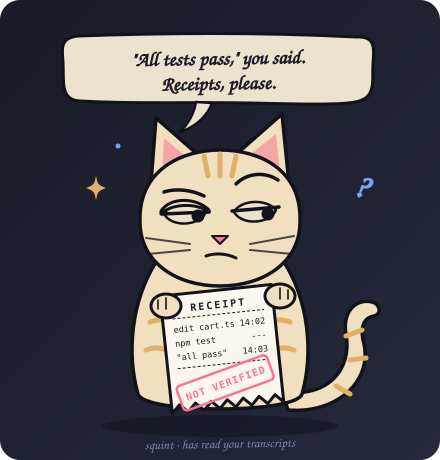

<p align="center">
  
</p>

<h1 align="center">trust-issues</h1>

<p align="center"><b>Your coding agent says it's done. It says that a lot.</b></p>

<p align="center">
A skill that teaches your agent to show receipts, and a hook that sends it back when it says<br>
the tests pass without running them, or makes the tests easier instead of the code right.
</p>

<p align="center">
  
</p>

<p align="center"><sub>A reenactment. The agent's lines are scripted; the hook's words are its real output for that transcript, pinned by a test.</sub></p>

## Excuses it stops accepting

| Your agent says | What actually happened | trust-issues |
|---|---|---|
| "All tests pass." | Nothing ran after the last edit. | *No test ran after your last edit to cart.ts. Run the tests and quote the pass/fail line.* |
| "All 14 tests pass." | `npm test \| tail` exited 0. One test failed. | *The last run said `ℹ fail 1`.* |
| "Those two failures are pre-existing." | It never ran the old code. | *Run the failing tests on the old code (git stash, run, git stash pop) and quote both results.* |
| "Simplified the test. All green now." | Four assertions are gone. | *You deleted 4 assertions.* |
| "Done, all green." | The failing test is now `it.skip`. | *You skipped a test. Undo it and fix the code, or tell the user plainly what you did and why.* |
| "Fixed the type errors." | Three new `// @ts-ignore`. | *You silenced a checker.* |
| "I've verified the fix." | It read the file again. | *Nothing ran after your last edit; reading isn't running.* |
| "It should work now." | Nothing ran. | *Run it and quote what it printed.* |

It does not argue with honest agents. If the receipt is there, or the agent already told you what it skipped and why, trust-issues stays quiet.

## Install

**Claude Code** (skill and hook), inside Claude Code:

```
/plugin marketplace add zuhairadnansutrisno2502-lab/trust-issues
```
```
/plugin install trust-issues@trust-issues
```

**Codex, Cursor, Gemini CLI, OpenCode and other agents that read skills** (the skill, no hook):

```bash
npx skills add zuhairadnansutrisno2502-lab/trust-issues
```

**CI**, to fail a pull request that skips, focuses or fakes a test (needs `fetch-depth: 0`):

```yaml
- run: npx -y trust-issues check origin/${{ github.base_ref }}
```

## How often does yours do it?

```bash
npx trust-issues
```

It reads your Claude Code history (`~/.claude/projects`) and grades it: every time the agent said the tests pass, something is fixed, or it verified something, was there a run after its last edit to back it up? Nothing leaves your machine.

```
trust-issues  69 turns where Claude Code changed code · Jul 7 – Sep 21

  "tests pass"          6 claims    6 backed    0 no receipt    0 after a failing run
  "fixed" / "works"    16 claims   16 backed    0 no receipt
  "verified"           12 claims   11 backed    1 no receipt
  silent tampering      0 times  none

  receipts missing
  Aug 1   "Status: rules.js (28 rules, ~60 package names, all versions verified)"
          nothing ran after your last edit to outgrown/verify-rules.js; reading isn't running

  grade A   trust issues: unfounded. For now.
```

That is the author's own card after three months with a good model (the flagged quote is translated from Indonesian). Even there, one "verified" came right after the agent edited the very script it had verified with.

<!-- STUDY -->

## What it checks

**Claims.** A sentence in the agent's final message that says the tests pass, something is fixed or works, it verified something, or a failure is pre-existing. English, Indonesian and Chinese. Questions, conditions ("once the tests pass"), negations and code blocks don't count.

**Receipts.** A command that ran after the last edit to a code file. For "tests pass" it has to be a test run, and its output must not show failures, whatever the exit code says. For "fixed" and "verified", anything that executed code. For "pre-existing", a run on the code from before the change (`git stash`, a worktree, a checkout).

**Tampering.** Always: a test that was skipped outright (`it.skip("...")`, `@pytest.mark.skip`, `xit`, `@Disabled`; a platform guard like `skipif(os.name == "nt")` is fine), focused with `.only`, turned into a todo or given an assertion that cannot fail; `|| true`, `continue-on-error` or `--passWithNoTests` around a test command; `--no-verify`. Only next to a claim of success, because honest refactors look the same: fewer assertions than before, a deleted test file, a fresh `@ts-ignore`, `eslint-disable` or `# noqa`. In CI there are no claims to read, so `check` fails on the first group and lists the second for a human.

**Manners.** It sends the agent back at most once for the same thing. Anything the agent already owned up to ("skipped the flaky test because the staging API is down") is not silent, so it passes. It is a handful of regexes, not a judge: it will miss a clever lie, and it tries very hard not to accuse an honest agent.

## What's inside

- [`skills/trust-issues/SKILL.md`](skills/trust-issues/SKILL.md): seven rules and a Receipts block, for any agent that reads skills.
- [`hooks/hooks.json`](hooks/hooks.json): the Claude Code `Stop` and `SubagentStop` hooks.
- [`bin/trust-issues.mjs`](bin/trust-issues.mjs): the whole thing. One file, no dependencies, about 0.1 s per reply even on a 270 MB transcript.

## FAQ

**My agent is honest.** Then you'll never hear from trust-issues. That is the point.

**What does it cost?** The hook runs outside the model, so no tokens at all. The skill adds about 110 tokens to a session and about 570 when it fires (Claude Code's own estimate, from `claude plugin details`).

**Can it get stuck?** No. Same complaint twice and it lets the agent stop; Claude Code also caps stop hooks on its side.

**Codex and Cursor hooks?** The skill works there today. Hooks for them are next; the checks are the same.

**It flagged something it shouldn't have.** Please open an issue with the sentence it quoted. False accusations are the bug this project cares about most.

## License

MIT. If an agent ever told you the tests pass, you know why this exists.
